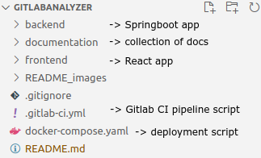
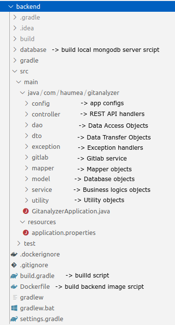
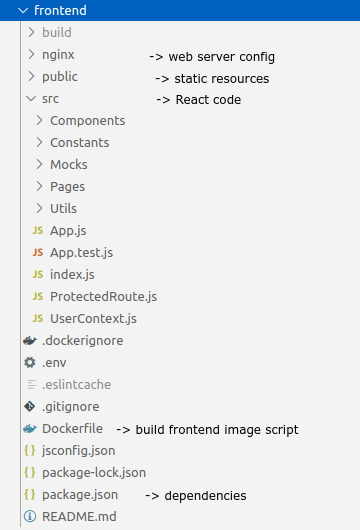

# Gitlab Analyzer

## Introduction

A web app for analyzing individual contribution to a Gitlab project. 

## Directory Structure

## Top level



## `backend` 



## `frontend` 



## Directions

To run the program on the team VM, please follow the instruction below.

### Dependencies

The following dependencies are already installed on the team VM, no further actions required. 

- `Docker` 
- `Docker-compose` 
- `nginx`

### Build & Run 

- Login to the team VM: `ssh -p 24 YourSfuId@cmpt373-1211-11.cmpt.sfu.ca `
- Clone the git repo: `git clone git@csil-git1.cs.surrey.sfu.ca:373-2021-1-Haumea/gitlabanalyzer.git`
- Build & Run the app:

  ```
  cd gitlabanalyzer
  docker-compose down --rmi all
  docker-compose up --build -d
  ```
- The web app is live at: http://cmpt373-1211-11.cmpt.sfu.ca/
