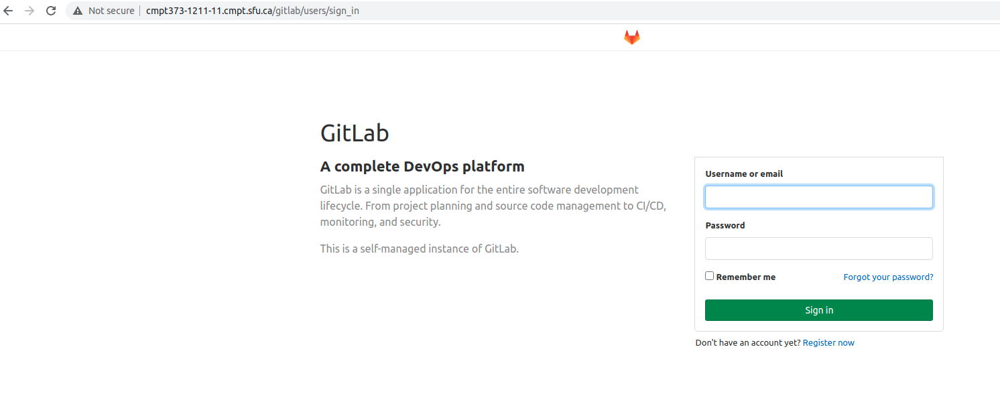
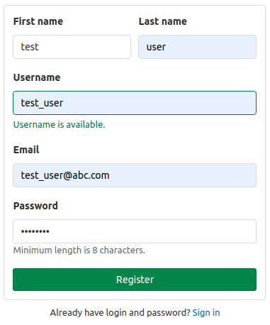
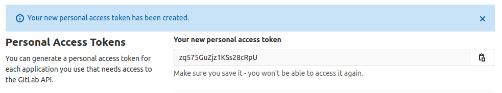
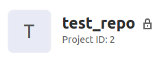

# Step to start the gitlab server

1. Login to the VM via ssh
    ```
    ssh yourSfuId@cmpt373-1211-11.cmpt.sfu.ca -p 24
    ```

2. Start the server

    ```
    docker start gitlab_server_container_web_1
    ```

3. Check its status 

    ```
    docker ps
    ```

    It will take about 4 minutes for the container to be ready. Under `STATUS` column, when you see change to `(healthy)`, that mean the server is ready. 

# Access the server on your browser

1. Go to `http://cmpt373-1211-11.cmpt.sfu.ca/gitlab`, you should see the sign in screen:

    

2. To login as admin: username: `root`, password: `haumea2021` 

3. To access `Admin Area`, click the wrench symbol at the top:

    

4. To create a user
  - If you currently login as admin, logout first
  - Back the the sign in screen, click `Register now`
  - Fill in required info, they can be anything, for example I created a user whose name is `test user`, username is `test_user` and email address is `test_user@abc.com`, pass minimum length is 8 characters. Then click `Register`. 

    

  - You will see this message: `You have signed up successfully. However, we could not sign you in because your account is awaiting approval from your GitLab administrator.`
  - Now log back in as admin, then go the `Admin Area` and approve the user you just register (click the gear symbol to see the dropdown menu). 

      
  - Logout then login as the user you just approved  
  - Add a `Personal Access Tokens` for your user, we will need this for the API call:
   
   

  - You can add a SSH Key if you want to use ssh to work with the repo locally, otherwise, you can just use HTTP.  

  - Create a test repo (just like how you usually create a repo), its content can be whatever you want, make at least 1 commits. I created a repo named `test_repo`. 

# Make sample API calls

- Let's try the API call to [list a repository commits](https://docs.gitlab.com/ee/api/commits.html#list-repository-commits)

  - Format: `GET /projects/:id/repository/commits`

  - For example: `curl --include "http://cmpt373-1211-11.cmpt.sfu.ca/gitlab/api/v4/projects/2/repository/commits?private_token=<your_personal_access_token>"`

  - `:id` is the project id:

    

  - The API allow us to add attribute like `since`, `until` etc., so we can filter for time interval for example. 
  - You can check out [Postman](https://learning.postman.com/docs/getting-started/introduction/), it's like curl with GUI. 

- Now we don't want to  create this long request string ourself, thus we use a an API client. The library will build the API call for us. For example, using [this API client](https://github.com/gitlab4j/gitlab4j-api#usage-examples), we can make API call in our Java program:

  ```java
  // Create a GitLabApi instance to communicate with your GitLab server
  GitLabApi gitLabApi = new GitLabApi("http://your.gitlab.server.com",  "YOUR_PERSONAL_ACCESS_TOKEN");

  // Get the list of projects your account has access to
  List<Project> projects = gitLabApi.getProjectApi().getProjects();
  ```

  - Instead of: `curl --include "http://your.gitlab.server.com/api/v4/projects?private_token=<your_personal_access_token>"`

# Todo:

- Switch to https instead of http
- Add other authentication options
- Automate the process of creating test repos


