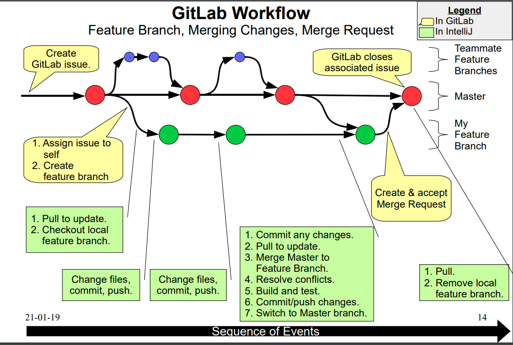
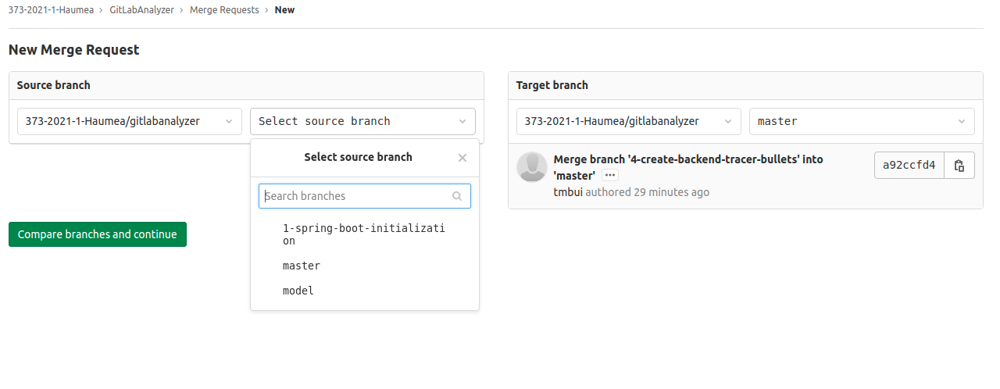
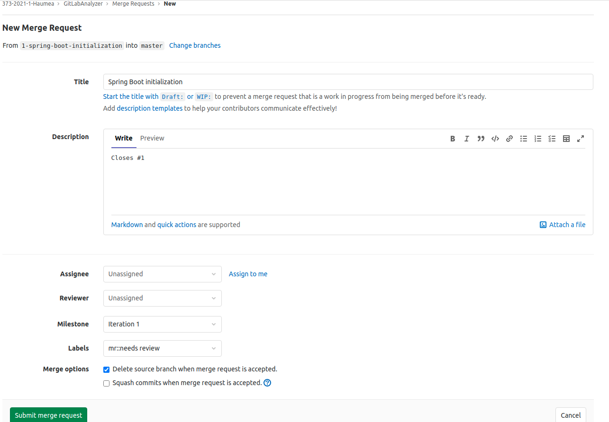

# Important note   

NEVER modify the master branch directly, always add changes in a branch, merge the most recent master into your branch, resolve conflicts, before **submit a merge request** to merge the branch back the master.  

# First time you pull the repo to your local machine

When you pull the repo for the first time, git will only pull the `master` branch. To work on an issue (or any time you want to modify the code in the backend or frontend folder), you will either create/pull/switch to a branch on your local machine. 

- Switch to a local branch: `git checkout branch-name`
- Create a local branch and switch to it: `git checkout -b branch-name`
- Pull remote branch to local (if it's not already exist): `git checkout --track origin/branch-name` 
- Push a local branch on remote repo (if it's not already exist): `git push -u origin branch-name` 
- To see what branch you're currently on: `git branch`
- To merge master to your branch:
  ```
  # switch to master
  git checkout master
  # pull lastest changes
  git pull
  # switch back to your branch
  git checkout your-branch
  # merge master to your branch and resolve conflicts if needed
  git merge master
  ```
- To merge your branch to master: push the latest local changes of your branch to its remote counterpart, then go to gitlab and submit a merge request

# GitLab Workflow



(source: Dr. Brian Fraser, [link](https://opencoursehub.cs.sfu.ca/bfraser/grav-cms/cmpt373/notes/files/04-GitLabProcess-c.pdf))

1. Create an issue for the feature/bug you want to track
2. Create a branch (either locally or through GitLab) for the issue you created (or any issue that no one is 
   currently working on and you want to start working on it)
    - Branch naming convention: `issueID-issue-title`, for example, if you create a branch to resolve issue 
      number 9, whose title is  
    "lift component up", name your branch as "9-lift-component-up"
      - NOTE: if you create a branch to work on multiple issue, say issue number 6, 8, 10, then name your branch as: `close-6-8-10` and when you submit your merge request, in the description, enter `Fix #6, #8, #10` to trigger the closing issues automatically feature (more details, see step 4 bellow).
          
3. Working in your branch as you normal do: write code, add, commit, push (note: **you do all of this on your branch not the master branch**)
4. When you are ready to submit a merge request:
    - Locally:
        - checkout branch master
        - pull to get latest changes made to master while you were working your own branch
        - check out your branch
        - merge branch master into your branch, resolve all conflicts
        - push the latest changes of your local branch to its remote counterpart
    - GitLab:
        - Create a merge request
            - Fist click on the Merge Requests tab and then click on the New merge request button, you will see 
          something similar to this:
            
               

               - Select the source branch and target branch from the dropdown and then click on the `Compare branches 
              and continue`.
          
            - Config you merge request: 
           
               
               
               - See that `Closes #1` in the description? That's because the branch name in this case start with
          number 1, GitLab automatically assume that this merge request is to close issue number 1. And when this 
            merge request is merged into master, GitLab will automatically close issue #1 for us. Read more about 
            [Closing issues automatically](https://docs.gitlab.com/ee/user/project/issues/managing_issues.html#closing-issues-automatically).
                 
               - Pick label(s): `mr::need reviews` and may be the frameworks/tool related to this merge request, e.g., Spring Boot, MongoDB, React etc., so the reviewer(s) get an ideas about what syntax they will be reading.
               - NOTE: DO NOT select "Squash commits when merge request is accepted", this will condense your commit 
                 history, thus negatively affect how they mark your contribution.
               - Whether to keep or delete your branch after the merge is entirely up to you. 
            - Submit your merge request and wait for the reviews to come in! 
   
# Workflow for adding/modify the documentation 

- Again, do not modify master directly.  
- Do as follow: 
    - checkout documentation branch, pull most recent changes (since we all share this branch)
    - working your documenation on the documentation branch (edit, commit, push)
    - once done, checkout master, pull most recent changes -> checkout documenation branch, merge master into it, there should be no conflicts involving fontent and backend code
    - merge documentation branch back to master, you can do this in 2 way:
        - if you don't need any feeback on your doc, do the merge locally then push to master directly
        - create a merge request, just don't select detele source branch after merge 

**May be we can make an exception on the rule of not modify master directly if you just work on the documentation folder? Or maybe from now on, we never merge documentation branch back to master again?**